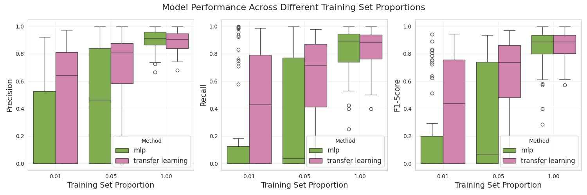

# scTranscriptome: A Decoder-Only Transformer for Single-Cell RNA-Seq Analysis

## This repository contains a decoder-only transformer model designed for analyzing single-cell RNA sequencing (scRNA-seq) data.

## Downstream Task
- Cell Type Annotation: Leveraging pre-trained representations for accurate cell type identification. 

## Model Training
### The decoder-only model was pretrained on 156,726 single cells * 33159 genes of the human embryonic meninges at 5-13 weeks post conception. 

### The hyperparameter tuning is done by Ray.tune, we found a decoder_layer=4, head=4 is the best hyperparameters for cell representation. The training scripts is wrapped up in 

## Performance Highlights
### The pre-trained model generates highly effective cell representations for cell type annotation:
- given 1% or 5% training dataset, the pretrained model+MLP is outperform over MLP in precision and recall.

